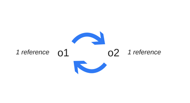
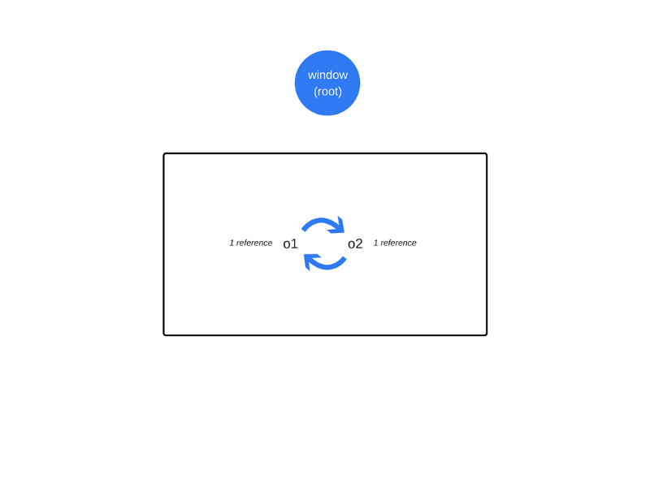

# JavaScript内存那点事


C、C++语言需要手动管理内存的分配与释放（常用方法：malloc(), calloc(), realloc()和free()等）。而JavaScript与Java、C#相似，内置了垃圾回收器，能自动管理内存的分配与释放。

## 内存生命周期:

1. 分配内存
2. 使用分配的内存(读与写操作)
3. 当应用程序不再需要时，释放掉已分配的内存


虽然内存自动进行分配、释放，但并不意味着开发者不需要关注内存管理。因为一些不好的编码会导致[内存泄露](https://en.wikipedia.org/wiki/Memory_leak#Reference_counting_and_cyclic_references)，即应用程序不再需要的内存没有被释放掉。因此了解内存管理是很重要的


## Javascript中的内存分配


当声明变量时，JavaScript会自动为变量分配内存
```js
var numberVar = 100; //为整数分配内存
var stringVar = 'node simplified';  // 为字符串分配内存 
var objectVar = {a: 1}; // 为对象分配内存
var a = [1, null, 'abra']; // 为数组分配内存
function f(a) {
  return a + 2;
} // 为函数分配内存 
```
当内存不再需要时，会自动释放掉。内存泄露和在释放内存时出现的大部分与内存相关的问题，而要找出那些被垃圾回收器跟踪不再需要的而又没有被释放的内存是很困难的。

## GC(Garbage collection)
垃圾回收是追踪并释放应用程序不再使用的内存过程。垃圾回收器通过算法来实现追踪应用程序不再使用的内存。主要涉及的垃圾回收算法如下：

- Reference-counting garbage collection（引用计数）
- Mark-and-sweep algorithm（标记清除）

### Reference-counting garbage collection（引用计数）
引用计数算法是一种最基础的垃圾回收算法，当一个对象的引用数为零时，会被自动回收。该算法将一个对象的引用数为0时视为应用程序不再需要的内存。

```js
!function (){
  var o1 = {a: {b: 2}},// 两个对象被创建A:{a: {b: 2}}，B:{b: 2}，对象B被对象A的属性a引用，对象A被赋值给变量o1。A和B的引用数都为1，因此不能被回收。
      o2 = o1; // 将对象A赋给变量o2。此时A引用数为2，B引用数1。
      o1 = 1;// 将变量o1对对象A引用切断。此时A引用数为1，B引用数1。
  var oa = o2.a; // 将对象B赋值给变量oa。此时A引用数为1，B引用数2。
      o2 = 'foo'; // 将变量o2对对象A引用切断。此时A引用数为0，B引用数1。因为对象A的a属性被变量oa引用，因此对象A不能被释放。
      oa = null; // 将变量oa对对象B引用切断。此时A引用数为0，B引用数0。A与B会被回收。
}()
```

#### 引用计数的限制：循环引用
  循环引用存在一个限制。如下实例，两个对象相互引用，形成一个循环引用。正常情况下，当函数执行完后，对应的内存会被释放掉。而**引用计数算法**会将循环引用对象的引用数都视为至少为1，因此不能被回收。

```js
function f() {
  var o = {};
  var o2 = {};
  o.a = o2; // o references o2
  o2.a = o; // o2 references o

  return 'azerty';
}

f();
```



#### 常见问题实例

  IE6-7的DOM对象是基于计数引用算法进行垃圾回收的。而循环引用通常会导致内存泄露：

```js
var div;
window.onload = function() {
  div = document.getElementById('myDivElement');
  div.circularReference = div;
  div.lotsOfData = new Array(10000).join('*');
};
```
如上述实例，DOM元素div通过自身的“circularReference”属性循环引用自己。如果没有显式将该属性删除或设为null，计数引用垃圾回收器会始终持有至少一个引用。即使DOM元素从DOM树种移除，DOM元素的内存会一直存在。如果DOM元素持有一些数据（如实例中“lotsData”属性），该数据对应的内存也无法被释放。


### Mark-and-sweep algorithm（标记清除）

该算法将“对象不再需要”的定义简化为“对象不可到达”。
这个算法假设有一组被称为roots的对象（在JavaScript中，root就是全局对象）。垃圾回收器会定期地从这些roots开始，查找所有从根开始引用的对象，然后查找这些对象引用的对象……。从roots开始，垃圾回收器会查找所有可到达对象，并回收不可到达的对象。

为了确定对象是否需要，该算法要确定对象是否可到达。由如下步骤组成：

1. 垃圾回收器会创建一组roots，roots通常是持有引用的全局变量。在JavaScript中，window对象就可作为root的全局变量。
2. 垃圾回收器会检查所有的roots并标记为活跃状态。然后递归遍历所有的子变量。只要从root不能到达的都被标记为垃圾。
3. 所有没有被标记为活跃状态的内存块都被视为垃圾。垃圾回收器就可以释放这部分内存并把释放的内存返回给操作系统。


这个算法比引用计数算法更优，因为“零引用的对象”总是不可到达的，但反之则不一定，如循环引用。
截至2012年，所有现代浏览器都内置了**标记清除垃圾回收器**。在过去几年里所有对JavaScript垃圾回收的改进（[generational/incremental/concurrent/parallel garbage collection](http://www.memorymanagement.org/glossary/g.html#term-generational-garbage-collection)）都是基于**标记清除算法**来实现的，并没有改变**标记清除算法**本身和它对“对象不再需要”定义的简化。

#### 循环引用不再是问题
前面循环引用的实例中，在函数执行完后，两个对象不再被全局对象可访问的对象引用。因此这两个对象被垃圾回收器标记为不可到达，接着被回收掉。


#### 限制：需要明确无法到达的对象
尽管这是一个限制，但实践中很少遇见这种情况，所以开发者不太会去关心垃圾回收机制。


## 参考文章：

- [Memory Management And Garbage Collection In Javascript](http://www.nodesimplified.com/2017/08/javascript-memory-management-and.html)
- [Memory Management](https://developer.mozilla.org/en-US/docs/Web/JavaScript/Memory_Management)
- [How JavaScript works: memory management + how to handle 4 common memory leaks](https://blog.sessionstack.com/how-javascript-works-memory-management-how-to-handle-4-common-memory-leaks-3f28b94cfbec)
- [Memory Management Reference](http://www.memorymanagement.org/glossary/g.html#term-generational-garbage-collection)

---

> 声明:本资料仅供学习交流，严禁使用于任何商业用途! 如需转载，转载请注明出处。

---