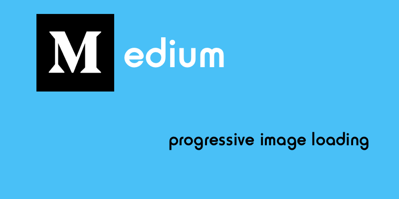
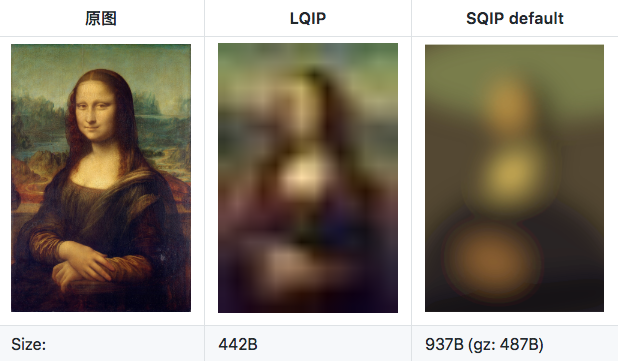
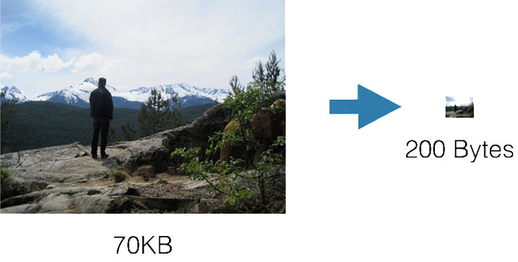
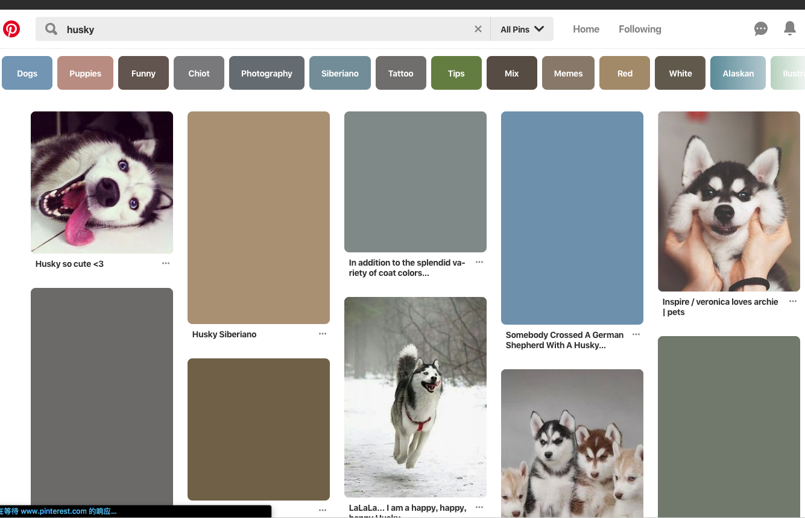

# Medium 渐进性图片加载 （Medium progressive image loading）



一直对 [Medium](https://medium.com/) 的渐进性图片加载颇感兴趣，刚好最近有时间折腾了一下🤘。小有收获，并在自己的 [blog 站点](https://www.zhansingsong.com)实践了一下，总体体验还是不错滴😆。虽然之前对其实现思路有个大概的了解，但当自己深入研究后，发现还是有些值得探讨的技术点。如缩略图的支持、模糊效果处理、如何撑开缩略图等。
> singsong: blog 站点的渐进性图片加载并未完全按照 Medium 的实现方式，在其基础上稍微做了一些调整。不过整体效果基本上是一样滴。
<!-- more -->
## 缩略图的支持

要实现渐进性图片加载，前提是需要后端对缩略图提供支持。关于缩略图的支持，之前自己写了一篇文章做了些介绍：[WebP 实战](https://www.zhansingsong.com/articles/5c34b552430eec101e95d405)，感兴趣的同学可以自行查看。另外，其他相关技术可以参考如下文章:

- [LQIP – Low Quality Image Placeholders](https://www.guypo.com/introducing-lqip-low-quality-image-placeholders)
- [SQIP – SVG-Based Image Placeholder](https://github.com/technopagan/sqip)

  

- [Facebook’s 200 bytes 技术](https://code.fb.com/android/the-technology-behind-preview-photos/)

  > the final format became one byte for version number, one byte each for width and height, and finally the approximately 200 byte payload. The server would just send this format as part of the GraphQL response, and then the client could simply append the JPEG body to the predefined JPEG header, patch the width and height, and treat it as a regular JPEG image. After the standard JPEG decoding, the client could run the predetermined Gaussian blur and scale it to fit the window size. [The technology behind preview photos](https://code.fb.com/android/the-technology-behind-preview-photos/)

  这是 Facebook 一种基于 JPEG 编码，将缩略图(最大 42*42)压缩到 200 字节的技术。单标准 JPEG 头大小就大于 200 字节，但除去 JPEG 头，图片编码有效数据大小刚好接近 200 字节。要实现将缩略图压缩到 200 字节，Facebook 将标准 JPEG 头固有部分移置客户端，最终图片就一字节的版本号、一字节宽度、一字节高度和数据体，总大小刚好约 200 字节。当数据传到客户端，客户端会将接受到的数据与保存在客户端头合成为最终的图片。

  

## Medium 官方实现代码

```html
<figure name="5a04" id="5a04" class="graf graf--figure graf-after--h4">
  <div class="aspectRatioPlaceholder is-locked" style="max-width: 800px; max-height: 400px;">
    <div class="aspectRatioPlaceholder-fill" style="padding-bottom: 50%;"></div>
    <div class="progressiveMedia js-progressiveMedia graf-image is-canvasLoaded is-imageLoaded" data-image-id="1*9bVaonlM0iP8mSu45GzIeg.png" data-width="1200" data-height="734" data-action="zoom" data-action-value="1*9bVaonlM0iP8mSu45GzIeg.png" data-scroll="native" >
      
      <canvas class="progressiveMedia-canvas js-progressiveMedia-canvas" width="40" height="20" ></canvas>
      
      <noscript class="js-progressiveMedia-inner"></noscript>
    </div>
  </div>
</figure>
```

这么一坨代码看不出什么来呀 🤣~~~~！怎么破，接着往下看 👇

## 剖析 Medium 代码

> singsong：为了方便讲解，这里删掉了一些无用的类名，绑定属性数据。并将样式内联于标签内，如果是在实际项目可将其移至 css 文件中。

### 1. 限制容器的最大宽高

```html
<figure>
  <!-- 容器 -->
  <div style="max-width: 800px; max-height: 400px; width: 100%;"></div>
</figure>
```

这里最大宽高需要由后台计算提供。之所以这里使用`max-width`、`max-height`，主要为了自适应响应。

### 2. 撑开缩略图

```html
<figure>
  <!-- 容器 -->
  <div style="max-width: 800px; max-height: 400px; width: 100%;">
    <!-- 撑开缩略图 -->
    <div style="padding-bottom: 50%;"></div>
  </div>
</figure>
```

> singsong: 这里可能有些读者会好奇，为什么还需要使用一个额外的元素来撑开缩略图呢？直接给缩略图设置固定宽高不就完事了么。如果你不考虑自适应响应，那样操作是木有任何问题滴。

要撑开缩略图需要同时满足如下条件：

- 撑开的宽高比必须与实际原图的宽高比保持一致。这样才能确保视觉上的一致，还能避免浏览器 reflow。
- 支持自适应响应。要做到自适应，需要使用相对单位。如百分比、rem 等。

宽高比可由后台计算提供。假设这里宽高比设为`ratio=50%;`。这里的宽是不需要处理，因为它的计算是参考父节点 width（即父节点设置了`width: 100%;`）。

主要工作是如何设置高。首先不能将高直接设置为: `height: 50%;`，这样是不能撑开高，因为它的计算是参考父节点高，而父节点的高此时为缩略图的高。那怎么破呢？🤔

> **The percentage is calculated with respect to the width of the generated box's containing block, even for 'padding-top' and 'padding-bottom'.** If the containing block's width depends on this element, then the resulting layout is undefined in CSS 2.1. [W3C-Specification](https://www.w3.org/TR/CSS2/box.html#padding-properties)

根据规范，padding 的 percentage 计算是参考父节点 width 来计算的。刚好满足撑开高的需求，设置：`padding-bottom: 50%;` 或 `padding-top: 50%;`即可。这样缩略图设置`height:100%; width:100%;`就能自适应撑开啦 😆

### 3. 渐进性加载

上述步骤已将容器创建好，接下来就是将图片放进去即可。代码如下：

```html
<figure>
  <!-- 容器限制高宽：800*400 -->
  <div style="position:relative; max-width: 800px; max-height: 400px; width: 100%;">
    <!-- 撑开高 -->
    <div style="padding-bottom: 50%;"></div>
     <!-- progressive-img容器 -->
    <div style="position: absolute; width: 100%; height: 100%; left:0; top: 0;" class="js-progressive-img">
      <!-- placeholder缩略图 -->
      
      <!-- 获取placeholder缩略图，将其写入canvas中，并对其应用高斯模糊效果 -->
      <canvas height="20", width="40" class="js-canvas" style="position: absolute; left:0; top:0; height: 100%; width: 100%;" crossorigin="anonymous"></canvas>
      <!-- 原图片 -->
      
      <!-- 不支持JS的回退方案 -->
      <noscript></noscript>
    </div>
  </div>
</figure>
```

这里使用了一个隐藏的 img 加载缩略图。如果你的站点是部署在 HTTP1.1 上，为了减少请求次数。可以将缩略图转换为 base64 内嵌在 canvas 上：

```html
<!-- progressive-img容器 -->
<div style="position: absolute; width: 100%; height: 100%; left:0; top: 0;" class="js-progressive-img">
  <!-- 获取placeholder缩略图，将其写入canvas中，并对其应用高斯模糊效果 -->
  <canvas data-src="data:image/PNG;base64,ABCDEFGHIJKLMNOPQRSTUVWXYZ" height="20", width="40" class="js-canvas" style="position: absolute; left:0; top:0; height: 100%; width: 100%;" crossorigin="anonymous"></canvas>
  <!-- 原图片 -->
  
  <!-- 不支持JS的回退方案 -->
  <noscript></noscript>
</div>
```

为什么这里 Medium 要选择使用 canvas，而不直接使用`img`呢？原因可能有如下两点：

- 如果缩略图的宽高比与原图的不一致，img 不能很好处理。如缩略图：20:11=1.81818，原图：1920:1080=1.77777; 而容器宽高比是按照原图设置的，即也为：1.77777。虽在视觉效果上没多大影响，不过使用 Canvas 可以很好地避免这样的问题。
- Canvas 能对图片做 blur 效果处理。虽然 css 也能处理 blur 效果，但兼容性不如 Canvas。

另外，还需要注意如下几点：

- `<canvas height="20", width="40" class="js-canvas" style="position: absolute; left:0; top:0; height: 100%; width: 100%;" crossorigin="anonymous"></canvas>` 这里的`height`、`width`是缩略图的宽、高，由后台计算提供。另外，需要设置`height: 100%; width: 100%;`，这样才能将 canvas 撑开为容器的大小。
- 元素之间的叠层顺序，img 原图一定要在 canvas 的上面。如果不这样叠放，别人想要 copy 你的图片。这时 copy 得到就会是缩略图了。

到这里，结构样式也已完成。接下来注入 JavaScript 逻辑。实现思路也很简单：

- 加载缩略图，并将其写入 canvas，再对其使用 blur 效果。
- 在原图加载完后，显示原图。这里可以配合懒加载，再加上一些过滤效果，可以让体验更加友好。

```js
const progressiveImg = document.querySelector(".js-progressive-img");
// 获取缩略图
const thumbnails = progressiveImg.querySelector(".js-thumbnails");
// 获取canvas
const canvas = progressiveImg.querySelector(".js-canvas");
// 获取原图
const image = progressiveImg.querySelector(".js-image");
// 获取canvas的context
const ctx = canvas.getContext("2d");

const drawImg = () => {
  ctx.drawImage(thumbnails, 0, 0);
  // stack-blur
  stackBlurCanvasRGBA(ctx, 0, 0, canvas.width, canvas.height, 3);
};
// thumbnails
thumbnails.onload = () => drawImg();
if (thumbnails.complete) {
  drawImg();
}
// progressive image
image.onload = () => {
  // 模拟网络延迟效果
  setTimeout(() => {
    image.style.opacity = 1;
    image.style.visibility = "visible";
  }, 1000);
};
```

这里 blur 效果是使用 [stackBlur](http://www.quasimondo.com/StackBlurForCanvas/StackBlurDemo.html) 完成的。完整实例代码：

<iframe height='265' scrolling='no' title='Medium loading image effect' src='//codepen.io/zhansingsong/embed/preview/GPwGMy/?height=265&theme-id=0&default-tab=html,result' frameborder='no' allowtransparency='true' allowfullscreen='true' style='width: 100%;'>See the Pen <a href='https://codepen.io/zhansingsong/pen/GPwGMy/'>Medium loading image effect</a> by zhansingsong (<a href='https://codepen.io/zhansingsong'>@zhansingsong</a>) on <a href='https://codepen.io'>CodePen</a>.
</iframe>

## 其他 blur 效果

当浏览器渲染被放大的缩略图时，为了不让用户看见像素块化图片，会应用一些模糊效果让其看起来更加平滑。所以，如果浏览器默认 blur 效果刚好满足你的需要，就不需要做额外的处理。

<iframe height='265' scrolling='no' title='browser default blur render' src='//codepen.io/zhansingsong/embed/preview/KbbVwW/?height=265&theme-id=0&default-tab=css,result' frameborder='no' allowtransparency='true' allowfullscreen='true' style='width: 100%;'>See the Pen <a href='https://codepen.io/zhansingsong/pen/KbbVwW/'>browser default blur render</a> by zhansingsong (<a href='https://codepen.io/zhansingsong'>@zhansingsong</a>) on <a href='https://codepen.io'>CodePen</a>.
</iframe>

但并不是所有图片都需要这种效果，如二维码图片可能就不需要这种渲染效果。可以参考如下方式关闭：

- [How to prevent Chrome from blurring small images when zoomed in?](http://superuser.com/questions/530317/how-to-prevent-chrome-from-blurring-small-images-when-zoomed-in)
- [image-rendering: pixelated(the browser would render it in a way that didn’t make it look blocky)](https://developers.google.com/web/updates/2015/01/pixelated)

<iframe height='265' scrolling='no' title='turn off browser blur' src='//codepen.io/zhansingsong/embed/preview/maaVJN/?height=265&theme-id=0&default-tab=css,result' frameborder='no' allowtransparency='true' allowfullscreen='true' style='width: 100%;'>See the Pen <a href='https://codepen.io/zhansingsong/pen/maaVJN/'>turn off browser blur</a> by zhansingsong (<a href='https://codepen.io/zhansingsong'>@zhansingsong</a>) on <a href='https://codepen.io'>CodePen</a>.
</iframe>

blur 效果也可使用 [CSS Filter](http://codepen.io/aniketpant/pen/DsEve)。[除了 IE 不支持外，其他浏览器都支持](http://caniuse.com/#feat=css-filters)。

<iframe height='265' scrolling='no' title='css Filter' src='//codepen.io/zhansingsong/embed/preview/WLLrro/?height=265&theme-id=0&default-tab=css,result' frameborder='no' allowtransparency='true' allowfullscreen='true' style='width: 100%;'>See the Pen <a href='https://codepen.io/zhansingsong/pen/WLLrro/'>css Filter</a> by zhansingsong (<a href='https://codepen.io/zhansingsong'>@zhansingsong</a>) on <a href='https://codepen.io'>CodePen</a>.
</iframe>

另外，还可以使用 [SVG filter](https://developer.mozilla.org/en-US/docs/Web/SVG/Element/filter)：

- [The “Blur Up” Technique for Loading Background Images](https://css-tricks.com/the-blur-up-technique-for-loading-background-images/)
- [Textured Gradients in Pure CSS](http://rentafounder.com/textured-gradients-in-pure-css/)

<iframe height='265' scrolling='no' title='SVG filter' src='//codepen.io/zhansingsong/embed/preview/VqqeQZ/?height=265&theme-id=0&default-tab=css,result' frameborder='no' allowtransparency='true' allowfullscreen='true' style='width: 100%;'>See the Pen <a href='https://codepen.io/zhansingsong/pen/VqqeQZ/'>SVG filter</a> by zhansingsong (<a href='https://codepen.io/zhansingsong'>@zhansingsong</a>) on <a href='https://codepen.io'>CodePen</a>.
</iframe>

## 其他相关加载技术

### Color Placeholder

与 progressive image loading 技术相比较，这种加载技术不是使用图片作为 Placeholder，而是使用原图的主要颜色(也称为 Dominant Color)作为 Placeholder。这种技术很适合图片多的情况，因为它不需要额外加载缩略图，而且又保证一定用户体验。像[Google](https://www.google.com/search?q=husky&safe=strict&source=lnms&tbm=isch&sa=X&ved=0ahUKEwiakr_LgevfAhVCA4gKHbbxDpEQ_AUIDigB&biw=1419&bih=1000)、[Pinterest](https://www.pinterest.com/search/pins/?q=husky&rs=typed&term_meta[]=husky%7Ctyped)图片展示就使用这种加载技术。



## 总结
本文主要对 Medium 渐进性图片加载的实现技术做了相关介绍，同时还对使用到的技术做了相关延展。在决定写这篇 blog 时，自己对其实现做了深入地研究，收获颇多。发现 Medium 在实现技术上，处理细节上，都有很多值得学习地方。本文只是将其中关键技术点做了介绍。另外，特别值得提一下的是： Medium 在实现技术别出心裁，实现方式并未按常规实现方式。如它的图片查看功能，它并没创建新的逻辑结构来展示图，而是在原图的结构基础上做处理，并使用 `padding` 来填充背景。感兴趣的同学可自行研究，我相信你一定会有收获滴。当然，自己也将该功能移置我的 blog 站点啦😆。

## 参考文章

- [Image Blur Texture](https://zurb.com/playground/image-blur-texture)
- [How Medium does progressive image loading](https://jmperezperez.com/medium-image-progressive-loading-placeholder/)
- [Progressive image rendering](https://slides.com/jmperez/pir-frontfest#/)
- [The technology behind preview photos](https://code.facebook.com/posts/991252547593574/the-technology-behind-preview-photos/)
- [Progressive Image Rendering](https://blog.codinghorror.com/progressive-image-rendering/)
- [Taking A Look At The State Of Progressive Images And User Perception](https://www.smashingmagazine.com/2018/02/progressive-image-loading-user-perceived-performance/)
- [The “Blur Up” Technique for Loading Background Images](https://css-tricks.com/the-blur-up-technique-for-loading-background-images/)
- [https://codepen.io/abramstyle/pen/Bzwqvr](https://codepen.io/abramstyle/pen/Bzwqvr)
- [Reproducing Medium loading image effect](https://codepen.io/jmperez/pen/yYjPER)
- [How do I implement progressive image loading?](https://www.quora.com/How-do-I-implement-progressive-image-loading)
- [Image Blur Texture](https://zurb.com/playground/image-blur-texture)
- [How to prevent Chrome from blurring small images when zoomed in?](https://superuser.com/questions/530317/how-to-prevent-chrome-from-blurring-small-images-when-zoomed-in)
