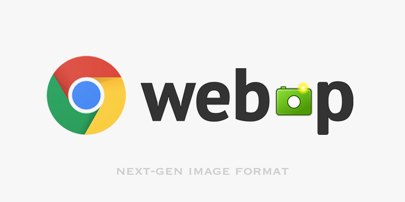
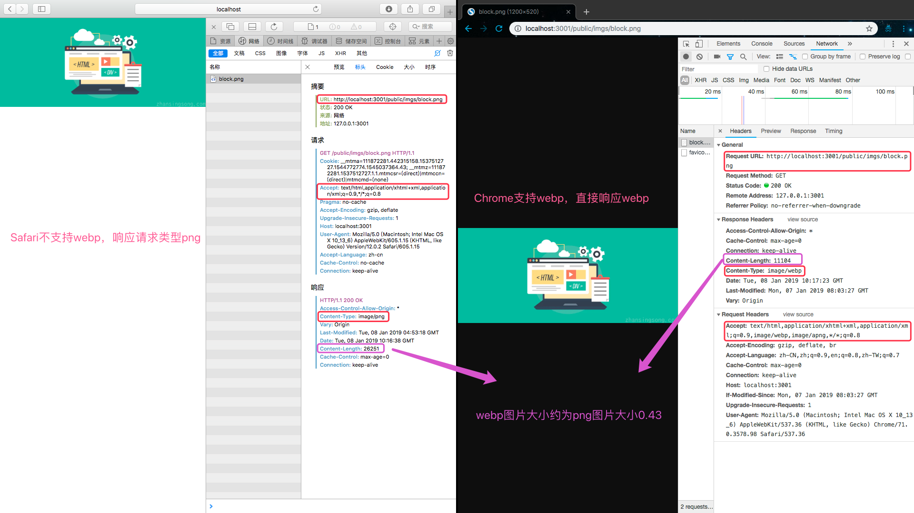

在搭建 blog 过程中，使用 [lighthouse](https://github.com/GoogleChrome/lighthouse) 审查站点。在性能项上提示`Serve images in next-gen formats`优化建议。

> Image formats like JPEG 2000, JPEG XR, and webp often provide better compression than PNG or JPEG, which means faster downloads and less data consumption.[Learn more](https://developers.google.com/web/tools/lighthouse/audits/webp)

JPEG 2000, JPEG XR, 和 WebP 与传统的 JPEG、PNG 相比具有高压缩比、高质量的特点。这让图片加载更快，带宽消耗更少。当前浏览器对 JPEG 2000, JPEG XR, 和 WebP 的支持情况：

<!-- more -->

- [WebP](https://caniuse.com/#feat=webp)：Chrome、Oprea、UC、QQ。其中 Firefox 新版已支持，Safari 已开始尝试支持。
- [JPEG 2000](https://caniuse.com/#feat=jpeg2000)：Safari
- [JPEG XR](https://caniuse.com/#feat=jpegxr)：IE

结合浏览器的支持情况，最终选择支持 WebP 来优化：

- 支持有损和无损压缩
- 支持动画
- 开源
- 技术支持团队是 Google
- [更多关于 WebP](https://developers.google.com/speed/webp/faq#how_can_i_detect_browser_support_for_webp)

## 如何支持 WebP

支持 WebP 有两种方式：

1. 客户端处理，这种处理方式需要提前准备好 WebP 图片。[如何将图片转换为 WebP 格式](https://developers.google.com/speed/webp/docs/using)

   - 使用 js 检测是否支持 WebP。

   ```js
   // check_webp_feature:
   //   'feature' can be one of 'lossy', 'lossless', 'alpha' or 'animation'.
   //   'callback(feature, result)' will be passed back the detection result (in an asynchronous way!)
   function check_webp_feature(feature, callback) {
     var kTestImages = {
       lossy: "UklGRiIAAABXRUJQVlA4IBYAAAAwAQCdASoBAAEADsD+JaQAA3AAAAAA",
       lossless: "UklGRhoAAABXRUJQVlA4TA0AAAAvAAAAEAcQERGIiP4HAA==",
       alpha:
         "UklGRkoAAABXRUJQVlA4WAoAAAAQAAAAAAAAAAAAQUxQSAwAAAARBxAR/Q9ERP8DAABWUDggGAAAABQBAJ0BKgEAAQAAAP4AAA3AAP7mtQAAAA==",
       animation:
         "UklGRlIAAABXRUJQVlA4WAoAAAASAAAAAAAAAAAAQU5JTQYAAAD/////AABBTk1GJgAAAAAAAAAAAAAAAAAAAGQAAABWUDhMDQAAAC8AAAAQBxAREYiI/gcA"
     };
     var img = new Image();
     img.onload = function() {
       var result = img.width > 0 && img.height > 0;
       callback(feature, result);
     };
     img.onerror = function() {
       callback(feature, false);
     };
     img.src = "data:image/webp;base64," + kTestImages[feature];
   }
   ```

   - 使用 HTML5 和 CSS3 特性支持检测库: [Modernizr](https://modernizr.com/) 。Modernizr.webp，Modernizr.webp.lossless，Modernizr.webp.alpha 和 Modernizr.webp.animation。
   - 使用 `<picture>` 元素

   ```
   <picture>
       <source type="image/webp" srcset="demo.webp">
       <source type="image/png" media="demo.png">
       
   </picture>
   ```

2. 服务端处理。相比客户端处理，在服务端处理更加灵活。因为它可以通过内容类型协商，能提前知道客户端是否支持 WebP（请求头中`Accept`字段）。如果支持就优先响应 Web 格式图片，否则就响应请求图片。
   - [Deploying New Image Formats on the Web](https://www.igvita.com/2012/12/18/deploying-new-image-formats-on-the-web/)

对比两种处理方式，通过服务端来支持 WebP 具有如下优势:

- 提前知道客户端是否支持 WebP。处理更灵活，更可靠。而客户端还需要根据是否支持 WebP，对链接做额外的替换处理。
- 动态支持 WebP。如果支持 WebP，查看本地是否有对应 WebP 图片，如果没有动态生成响应。

## 服务端动态支持 WebP

服务端要动态支持 WebP，可以由代理服务器 Nginx，或 Backend 来完成。

> singsong：图片处理逻辑最好交给下游 Backend 来完成，NGINX 就负责转发即可。当然也有自动处理图片 nginx ：[ngx_pagespeed](https://github.com/apache/incubator-pagespeed-ngx)

### Nginx 处理

1. 确保`mime.types`中有 WebP。因为如果没有 WebP 类型，WebP 图片会作为`application/octet-stream` 输出。

```bash
image/webp  webp;
```

1. 获取请求头 `Accept` 字段中的 `webp`

```js
map $http_accept $webp_suffix {
  default   "";
  "~*webp"  ".webp";
}
```

这里使用 map(更多参考[ngx_http_map_module](http://nginx.org/en/docs/http/ngx_http_map_module.html))定义了一个`$webp_suffix`变量，如果 WebP 存在，`$webp_suffix`值为`".webp"`，否则为空字符串。

3. 输出图片

   - 查看是否存在`.webp`的文件，如果存在就直接输出。
   - 查看是否存在请求文件，如果存在就直接输出。
   - 如果上述文件都不存在，就响应`404`。

```bash
    try_files $uri$webp_suffix $uri =404;
```

这里还可以将响应操作反代理给 Backend：

```bash
    if ($http_accept ~* "webp")    { set $webp_accept "true"; }

    location ~ ^/imgs.*\.(png|jpe?g)$ {
      # Pass WebP support header to backend
      proxy_set_header  WebP  $webp_accept;
      proxy_pass http://127.0.0.1:8080;
    }
```

[完整代码：](https://github.com/igrigorik/webp-detect/blob/master/nginx.conf)

```bash
worker_processes 1;

events {
  worker_connections 1024;
}

http {
  include mime.types;
  default_type  application/octet-stream;

  #
  # < regular Nginx configuration here >
  #

  # For a hands-on explanation of using Accept negotiation, see:
  # http://www.igvita.com/2013/05/01/deploying-webp-via-accept-content-negotiation/

  # For an explanation of how to use maps for that, see:
  # http://www.lazutkin.com/blog/2014/02/23/serve-files-with-nginx-conditionally/

  map $http_accept $webp_suffix {
    "~*webp"  ".webp";
  }
  map $msie $cache_control {
      "1"     "private";
  }
  map $msie $vary_header {
      default "Accept";
      "1"     "";
  }

  # if proxying to another backend and using nginx as cache
  proxy_cache_path  /tmp/cache levels=1:2 keys_zone=my-cache:8m max_size=1000m inactive=600m;
  proxy_temp_path /tmp/cache/tmp;

  server {
    listen       8081;
    server_name  localhost;

    location ~ \.(png|jpe?g)$ {
      # set response headers specially treating MSIE
      add_header Vary $vary_header;
      add_header Cache-Control $cache_control;
      # now serve our images
      try_files $uri$webp_suffix $uri =404;
    }

    # if proxying to another backend and using nginx as cache
    if ($http_accept ~* "webp")    { set $webp_accept "true"; }
    proxy_cache_key $scheme$proxy_host$request_uri$webp_local$webp_accept;

    location ~ ^/proxy.*\.(png|jpe?g)$ {
      # Pass WebP support header to backend
      proxy_set_header  WebP  $webp_accept;
      proxy_pass http://127.0.0.1:8080;
      proxy_cache my-cache;
    }
  }
}
```

想了解更多可以参考如下文章：

- [Ilya Grigorik: Deploying New Image Formats on the Web - webp](https://www.igvita.com/2012/12/18/deploying-new-image-formats-on-the-web/)
- [Eugene Lazutkin: Serve files with nginx conditionally - webp](http://www.lazutkin.com/blog/2014/02/23/serve-files-with-nginx-conditionally/)
- [Webp Detect - WebP with Accept negotiation](https://github.com/igrigorik/webp-detect)
- [my post on conditionally serving webp and jxr with nginx](https://corydowdy.com/blog/webp-jxr-nginx-content-negotiation-test)

### Backend 处理

Backend 是基于 [KOA](https://github.com/koajs/koa) 框架搭建的，要集成动态支持 WebP，需要完成如下两个任务：

- 获取请求头中的`Accept`字段，判断是否支持 WebP。这一步也可由 Nginx 来做。

```js
// 获取请求头：ctx.header.accept, ctx.headers.accept、ctx.req.headers.accept、ctx.request.headers.accept、ctx.request.header.accept
const isWebp = /webp/i.test(ctx.header.accept);
// 注意: 虽然 KOA 提供`ctx.accept('webp')`方法来判断accept type。但是该方法对webp判断存在bug，它会将`*/*`作为支持来处理。
```

- 添加图片处理功能。要动态支持 WebP，这就需要 Backend 具备图片处理功能。node 相关的图片处理库：

  - [sharp](https://github.com/lovell/sharp)
  - [jimp](https://github.com/oliver-moran/jimp)
  - [gm](https://github.com/aheckmann/gm)

sharp 相比于 jimp、gm 综合性能更好，对 WebP 支持更友好。因此这里使用 sharp 来实现图片格式转换、缩放、水印等功能。npm 对比数据：[gm vs jimp vs sharp](https://www.npmtrends.com/gm-vs-jimp-vs-sharp) 。

## 关键代码

```js
const fs = require("fs-extra");
const path = require("path");
const send = require("koa-send");
const sharp = require("sharp");
const glob = require("glob");
const TextToSvg = require("text-to-svg");

// 配置sharp
sharp.concurrency(1);
sharp.cache(50);
module.exports = async ctx => {
  // getSvgByText
  const getSvgByText = (text, fontSize, color) => {
    const textToSVG = TextToSvg.loadSync();
    const svg = textToSVG.getSVG(text, {
      fontSize,
      anchor: "top",
      attributes: {
        fill: color
      }
    });
    return Buffer.from(svg);
  };

  const originals = glob.sync(
    path.join(__dirname, "..", "public", "originals", "*.+(png|jpeg|svg|jpg)")
  );
  const nameMapOriginal = {};
  originals.forEach(original => {
    const metas = path.parse(original);
    nameMapOriginal[metas.name] = original;
  });

  // getOriginals
  const getOriginalsByName = name => nameMapOriginal[name];

  const imgProcessor = async (
    inputPath,
    outputPath,
    { overlay, width, blur }
  ) => {
    const image = sharp(inputPath);
    const metadata = await image.clone().metadata(); // 获取原图片的元数据
    const rawWidth = width || metadata.width;

    if (
      overlay !== "off" &&
      metadata.width > 160 &&
      metadata.height > 80 &&
      rawWidth > 160
    ) {
      const tempFontSize = (rawWidth * 0.03) | 0; // eslint-disable-line
      const fontSize = tempFontSize < 12 ? 12 : tempFontSize;
      overlay = getSvgByText(
        "zhansingsong.com",
        fontSize,
        "rgba(255, 255, 255, 0.3)"
      ); // eslint-disable-line
      await image
        .clone()
        .overlayWith(overlay, { gravity: sharp.gravity.southeast })
        .resize({ width: parseInt(width, 10) })
        .toFile(outputPath)
        .catch(err => ctx.app.emit("error", err));
    } else if (!blur) {
      await image
        .clone()
        .resize({ width: parseInt(width, 10) })
        .toFile(outputPath)
        .catch(err => ctx.app.emit("error", err));
    } else {
      await image
        .clone()
        .resize({ width: parseInt(width, 10) })
        .blur(1.3)
        .toFile(outputPath)
        .catch(err => ctx.app.emit("error", err));
    }
  };
  const { join, parse } = path;
  const { existsSync, ensureDirSync } = fs;
  // 编码中文乱码
  const url = decodeURIComponent(ctx.path);
  const metas = parse(url);
  const isWebp = /webp/i.test(ctx.header.accept); // 判断是否支持webp
  const isThumbnail = /^\/public\/thumbnails\//.test(url);
  const fileDir = isThumbnail
    ? join.apply(path, [
        __dirname,
        "..",
        "public",
        "thumbnails",
        `${ctx.query.width || 20}`
      ])
    : join.apply(path, [
        __dirname,
        "..",
        "public",
        "imgs",
        ...Object.values(ctx.query)
      ]);
  const filePath = join(
    fileDir,
    `${metas.name}${isWebp ? ".webp" : metas.ext}`
  );
  const options = isThumbnail
    ? {
        width: ctx.query.width || 20,
        overlay: ctx.query.overlay || "off",
        blur: true
      }
    : ctx.query;

  ensureDirSync(fileDir);
  if (!existsSync(filePath)) {
    await imgProcessor(getOriginalsByName(metas.name), filePath, options); // eslint-disable-line
  }
  await send(ctx, filePath, { root: "/" });
};
```

## 实现效果

通过 sharp 为 Backend 实现了一些简单图片处理接口：图片压缩、水印、格式转换。这也为后面缩略图的使用提供了支持。处理效果如下图所示：

从上图可知:

- Safari 和 Chrome 浏览器分别请求同一图片，响应结果各不相同。浏览器支持 WebP 时，会直接响应 WebP 图片。否则就响应请求图片。
- 相同质量的图片，WebP 格式大小约为 png 格式大小的 0.43。

## 总结

本文是自己在使用 WebP 的一些心得总结。主要对 WebP 的使用做个简单介绍。至于为什么要用 WebP，本文也做了相关介绍。但这并不代表 WebP 没有缺点。如在编解码效率上就存在不足。不过随着硬件设备的提升，这也在可接受范围内。随着移动互联网的快速发展，PWA(Progressive Web App)必成为 Web App 的主流。而 WebP 是 PWA 一个组成部分，了解并支持 WebP 已成大趋势。目前很多主流的站点已全站或部分支持 WebP。
