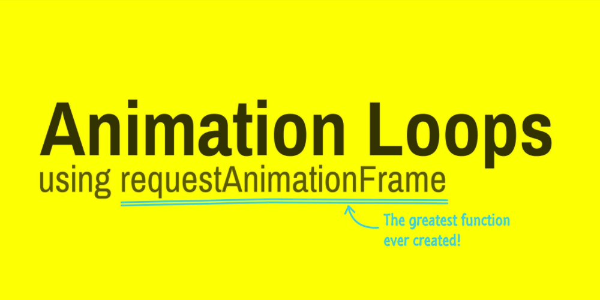

# requestAnimationFrame




## setTimeout

**语法**：setTimeout(function,delay)

**定义**：setTimeout()方法用于在delay毫秒数之后调用函数或计算表达式。

<u>setTimeout()指定的时间间隔表示何时将定时器的代码添加到任务队列中，而不是何时执行代码。</u>


## setInterval

**语法**：setInterval(function,delay)

**定义**：setInterval()方法可按照指定的delay周期（以毫秒计）来调用函数或计算表达式。　

<u>使用setInerval()创建的定时器确保定时器代码规则地插入任务队列中。不过仅当没有该定时器的任何其他代码实例时，才将定时器代码添加到队列中。这确保了定时器代码加入到队列中的最小时间间隔为指定间隔。</u>这种重复定时器会存在如下问题：

- 在某些间隔会被跳过
- 多个定时器的代码执行之间的间隔可能会被预期的小

可以通过如下链式setTimeout()调用模式来避免类似问题：

```js
setTimeout(function() {
  // do something. . . .
  setTimeout(arguments.callee, interval);
}, interval);
```

**不过setInterval()会不停地调用函数，直到窗口关闭或调用clearInterval()。当然如果链式setTimeout()调用模式没有终止逻辑，也会一直运行下去。因此再不需要重复定时器时，确保对定时器进行清除，避免占用系统资源。**

## requestAnimationFrame

>在JavaScript中创建动画的典型方式就是使用setInterval()方法来控制所有动画（或链式setTimeout()调用模式）。编写这种动画循环的关键是要知道延迟时间多长适合。一方面，循环间隔必须足够短，这样才能让不同的动画效果显得更平滑流畅；另一方面，循环间隔还要足够长，这样才能确保浏览器有能力渲染产生的变化。通常电脑显示器的刷新频率是60Hz，大概相当于每秒重绘60次，平均每次约等于17ms(1000ms/60)，以这个循环间隔重绘动画可到达最平滑效果。
虽然与使用多组setTimeout()的循环方式相比，使用setInterval()的动画循环效率更高，但后者也不是没有问题的。无论是setInterval()还是setTimeout()都不十分精确。<u>传递给它们的第二个参数，实际上只是指定了把动画代码添加到浏览器UI线程队列中以等待执行的时间点。如果队列前面已经加入了其他的任务，那动画代码就要等待前面的任务完成后再执行。另外，要保证动画平滑的关键是要知道下一帧的绘制时间点，而开发人员没有办法确保浏览器按时绘制下一帧。加上浏览器使用的[计时器并非精确到毫秒级别](http://www.ituring.com.cn/article/1828)。</u>

>CSS的transition和animation效果优于JavaScript实现的动画效果，原因在于CSS知道动画什么时候开始，会计算出正确的循环间隔，在适合的时候刷新UI。基于该问题，浏览器为了JavaScript动画添加了一个新API，即requestAnimationFrame()。


**语法**：[requestAnimationFrame(callback)](https://developer.mozilla.org/zh-CN/docs/Web/API/Window/requestAnimationFrame);

**定义**：告诉浏览器希望执行动画，并请求浏览器调用指定的函数在下一次重绘之前更新动画。

该方法使用一个回调函数callback作为参数，这个回调函数callback会在浏览器重绘之前调用。回调频率通常是每秒60次。回调函数callback会被传入一个参数[DOMHighResTimeStamp](https://developer.mozilla.org/zh-CN/docs/Web/API/DOMHighResTimeStamp)，指示从触发requestAnimationFrame回调到现在的时间。`requestAnimationFrame(callback)`会返回一个long整数，请求ID，也是回调列表中唯一的标识，一个非零值，可以传此值到 [ancelAnimationFrame(requestID)](https://developer.mozilla.org/zh-CN/docs/Web/API/Window/cancelAnimationFrame)以取消回调函数。

requestAnimationFrame基本思想是利用显示器的刷新机制，与刷新频率保持同步，并利用这个刷新频率进行页面重绘更新。不过需要注意：_因为JavaScript单线程工作机制，如果主线程一直处于繁忙状态，那么requestAnimationFrame的动画效果也会受影响的。_

### 使用
使用requestAnimationFrame的时候，只需反复调用它即可：

```js
function animation() {
  // do something ....
  requestAnimationFrame(animation);
}

requestAnimationFrame(animation);
```

### 优势
与setTimeout和setInterval相比，requestAnimationFrame有如下优势：

- 在后台标签页、不活动标签页、最小化窗口中，requestAnimationFrame会自动暂停，节省系统资源为其他任务。
- 在一个帧中对DOM的所有操作，只进行一次Layout和Paint更新。
- 利用显示器的刷新机制，知道动画何时开始，能确定动画最佳循环间隔时间及代码何时执行，并在适合的时候刷新UI。


不活动标签页中，setInterval与requestAnimationFrame的活动状态：

|           | setInterval |            requestAnimationFrame            |
|:---------:|:-----------:|:-------------------------------------------:|
|    IE9-   |      no     |                 no supported                |
|   IE10+   |      no     |                    paused                   |
|  Chrome9- |      no     |                 no supported                |
|  Chrome10 |      no     |                    paused                   |
| Chrome10+ |   >=1000ms  |                    paused                   |
| Firefox3- |      no     |                 no supported                |
|  Firefox4 |      no     |                      1s                     |
| Firefox5+ |   >=1000ms  | 2ns (n = number of frames since inactivity) |
|  Safari5- |      no     |                 no supported                |
|  Safari6  |      no     |                    paused                   |
|  Safari7+ |   >=1000ms  |                    paused                   |
|  Opera12- |      no     |                 no supported                |
|  Opera15+ |   >=1000ms  |                    paused                   |

注：
- **-**: <= 
- **+**: >=
- **no**: 没影响
- **no supported**: 不支持
- **paused**: 暂停
- **>=1000ms**: 时间间隔大于等于1000ms，即如果时间间隔小于1000ms会被调整为1000ms，如果时间间隔大于等于1000ms会用指定时间间隔
- **1s | 2ns**: 时间间隔（在Firefox不活动标签页中，requestAnimationFrame每帧消耗时间以2的次方依次递增：1s、2s、4s、8s.....）

 

### [兼容性：](https://caniuse.com/#feat=requestanimationframe)

<iframe height='540' title='caniuse-requestAnimationFrame' src='https://caniuse.com/#feat=requestanimationframe' frameborder='no' allowtransparency='true' allowfullscreen='true' style='width: 100%;'></iframe>

### [polyfill：](https://gist.github.com/paulirish/1579671)

```js
// http://paulirish.com/2011/requestanimationframe-for-smart-animating/
// http://my.opera.com/emoller/blog/2011/12/20/requestanimationframe-for-smart-er-animating

// requestAnimationFrame polyfill by Erik Möller. fixes from Paul Irish and Tino Zijdel

// MIT license

(function() {
    var lastTime = 0;
    var vendors = ['ms', 'moz', 'webkit', 'o'];
    for(var x = 0; x < vendors.length && !window.requestAnimationFrame; ++x) {
        window.requestAnimationFrame = window[vendors[x]+'RequestAnimationFrame'];
        window.cancelAnimationFrame = window[vendors[x]+'CancelAnimationFrame'] 
                                   || window[vendors[x]+'CancelRequestAnimationFrame'];
    }
 
    if (!window.requestAnimationFrame)
        window.requestAnimationFrame = function(callback, element) {
            var currTime = new Date().getTime();
            var timeToCall = Math.max(0, 16 - (currTime - lastTime));
            var id = window.setTimeout(function() { callback(currTime + timeToCall); }, 
              timeToCall);
            lastTime = currTime + timeToCall;
            return id;
        };
 
    if (!window.cancelAnimationFrame)
        window.cancelAnimationFrame = function(id) {
            clearTimeout(id);
        };
}());
```

## 参考文章

- [Animating with javascript: from setInterval to requestAnimationFrame](https://hacks.mozilla.org/2011/08/animating-with-javascript-from-setinterval-to-requestanimationframe/)
- [How do browsers behave when tab or window is not active?](http://satheeq.blogspot.com/2015/12/how-do-browsers-pausechange-javascript.html)
- [Jank Busting for Better Rendering Performance](https://www.html5rocks.com/en/tutorials/speed/rendering/)