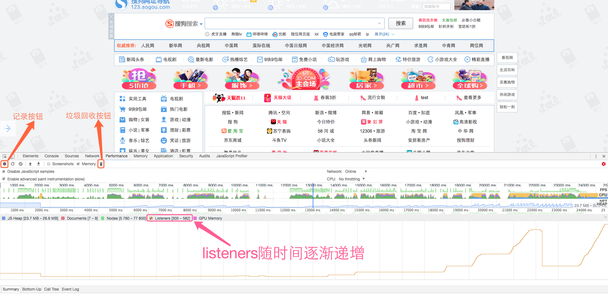
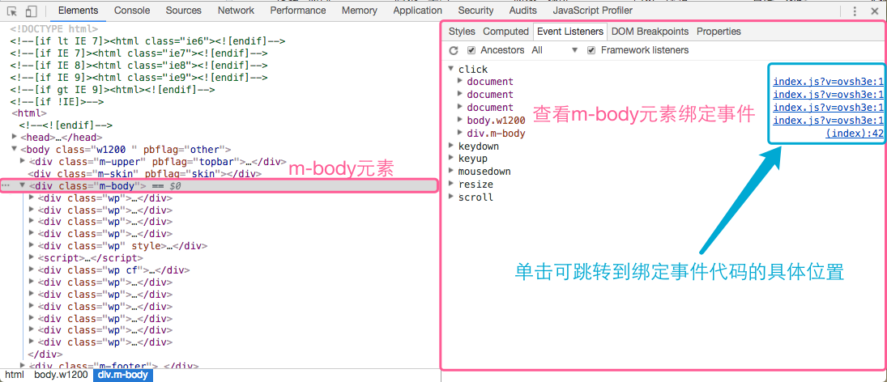
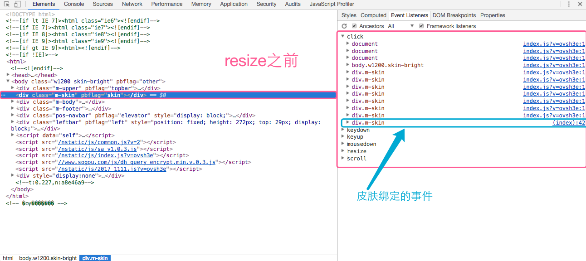
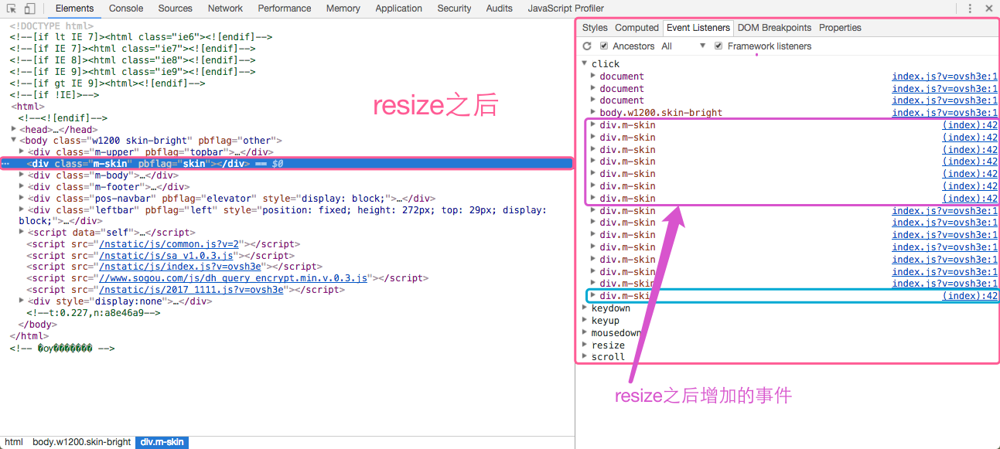
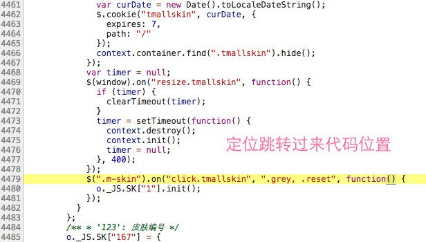
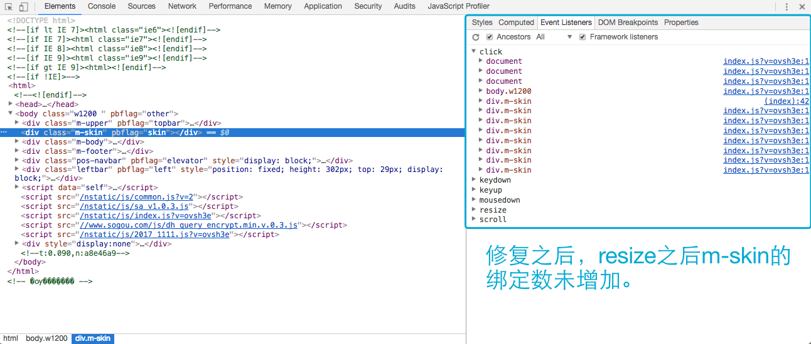

# 内存泄露之Listeners


页面中事件绑定数量会直接影响页面的整体运行性能，因为每个事件的回调处理函数都是一个对象，占用一定的内存。如果事件的绑定数量越多，内存也随之增加。另外，回调处理函数需要与DOM节点进行交互，而JS引擎独立于渲染引擎，而DOM是位于渲染引擎，相互访问需要消耗一定的资源。加上操作DOM，会引起浏览器的重排或重绘，而影响页面的整体性能。

> 事件代理 (事件委托) 利用了事件冒泡，只指定一个事件处理程序，就可以管理某一类型的所有事件。

因此如何控制事件绑定数量就很重要了，通常都是通过事件代理（事件委托）来解决类似的问题。不过有时借助了事件代理（事件委托），而页面的事件绑定数量也在不断地增加？这可能是某些“不好”代码导致的，那如何定位增加的原因就显得很关键了。这里可以通过chrome的**DevTools**来辅助诊断。

## DevTools

### 如何判断页面的事件绑定数量在增加：
 1. 打开DevTools->Performance，单击【记录按钮】开始记录页面相关performance数据。接着单击【垃圾回收按钮】，进行一次垃圾回收，创建基准参考线。
 2. 进行可能引起事件绑定数量增加的操作。
 3. 单击【stop】按钮，停止记录。



### 如何定位事件绑定数量的增加：
1. 打开DevTools->Elements，查看页面中绑定事件的元素。




## 实战
双十一快到了，各种tmall活动就多起来了。在做一个tmall动态皮肤时，需要在window大小变化时将之前构建的结构销毁，然后再重新计算构建。因为在销毁时，未解绑对应的事件。导致在window触发resize时，某个元素的事件绑定数量不断增加。关键代码如下：

```js
  var tmallskin = {
    init: function() {
      //......
      this.bindEvent();
    },
    destroy: function() {
      if (this.element.length > 0) {
        this.container.off("click.tmallskin");//该语句可以不用，因为在element.remove时会解除element上绑定的事件
        this.element.remove();
      }
    }
   // 绑定逻辑
   bindEvent: function() {
      var context = this;
      this.container.on("click.tmallskin", ".tmallskin-close",function() {
        //.... 
      });

      var timer = null;
      $(window).on("resize.tmallskin", function() {
        if (timer) {
          clearTimeout(timer);
        }
        timer = setTimeout(function() {
          // 窗口大小变化时，会不断执行destroy，init
          context.destroy();
          context.init();
          timer = null;
        }, 400);
      });
      // 因为未在destroy中解除该绑定，在window触发resize时，会不断地绑定
      $(".m-skin").on("click.tmallskin", ".grey, .reset", function() {
        o._JS.SK["1"].init();
      });
    }
  };
```
上述code中，因为在destroy方法中未对`$(".m-skin")`元素上绑定的事件进行解除，导致在window触发resize时，不断进行绑定。

- DevTools诊断截图如下：



- resize之后：



- 单击右侧定位链接`(index):42`：




### 知道问题的原因，修复代码如下：

```js
    //.....
    destroy: function() {
      if (this.element.length > 0) {
        this.container.off("click.tmallskin");
        $(".m-skin").off("click.tmallskin");//销毁时解除绑定
        $(window).off("resize.tmallskin");
        this.element.remove();
      }
    },
    //.....
```
效果截图：




## 总结
可能在实践编码中，很少关注主动解除事件绑定。如常用的Jquery库，会在元素删除时，自动解除元素上绑定的事件。不过难免存在某些情况，Jquery也无能无力，这时需要我们主动进行解绑，因为过多的事件绑定会直接影响页面的整体性能。因此了解如何诊断事件绑定的增加是很重要的，也希望本文对你有所帮助。
