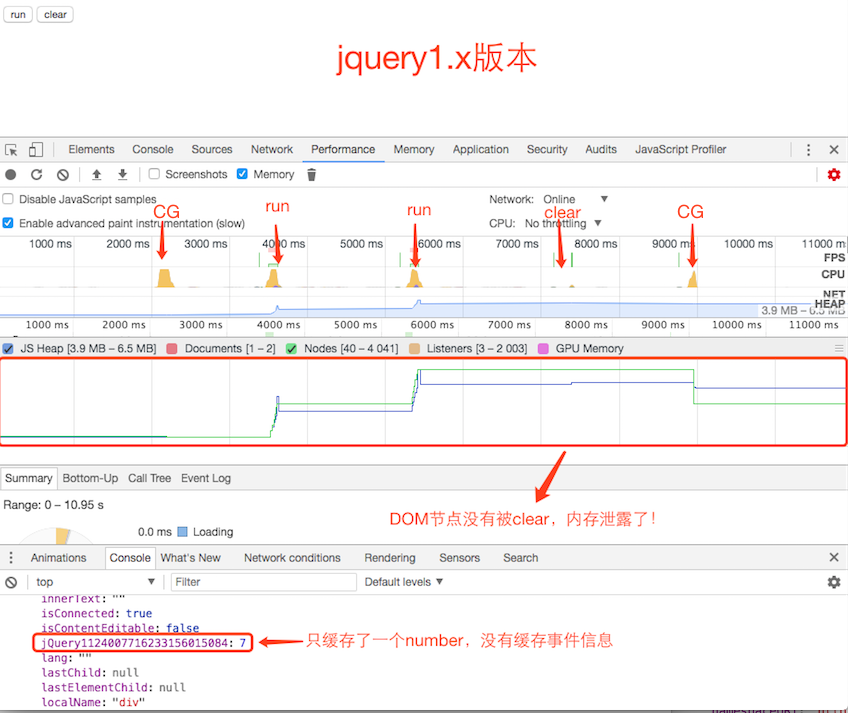
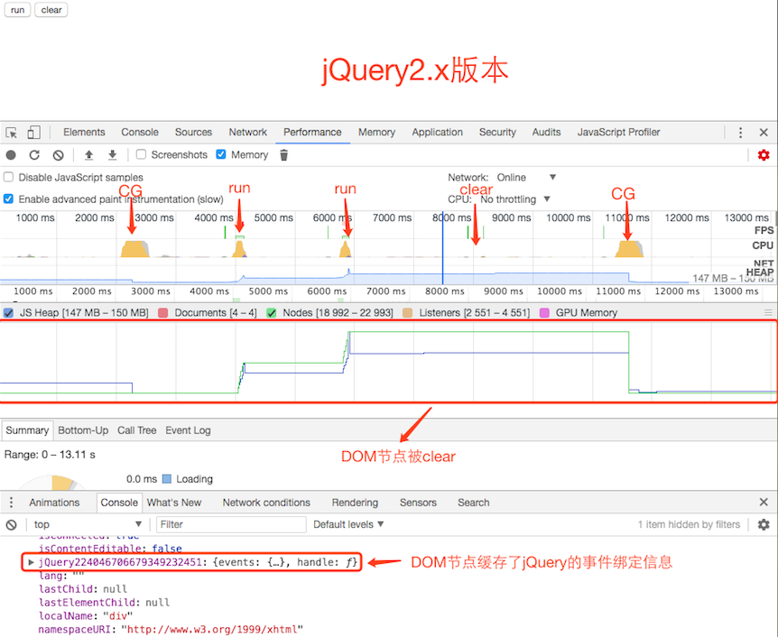
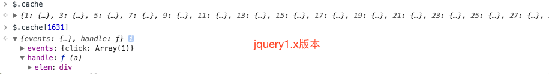
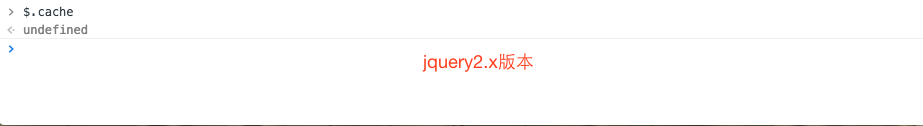

# 内存泄露之jQuery.cache


jQuery没有将事件和数据绑定在DOM节点上，而是将这些信息储存在`$.cache`对象上。jQuery对象每次新增事件或数据时，都在`$.cache`新增一条数据。而`$.cache`会持有对应DOM节点的引用，如果没有正确删除DOM节点，会导致DOM节点不能被回收。即DOM节点已从DOM中删除，但依然还存在内存中，没有被CG回收。正确的删除方式是通过jQuery的删除方法来移除：`remove()`,`empty()`,`html()`;

#### 上述提到不正确的删除方式，会导致DOM节点不能被回收，而导致内存泄露问题。如使用JavaScript内置方法（如removeChild，innerHTML）来删除jQuery绑定了事件或数据的节点。

```js
var $element = $('<div></div>');
$element.on('click', function() { ... });
$element.appendTo(document.body); 
var nativeElement = $element.get(0);
document.body.removeChild(nativeElement); // ← 通过removeChild方法移除nativeElement
```

上述代码中使用内置的removeChild方法移除nativeElement，此时仅仅只是将nativeElement与DOM脱离而已，并没有真正地删除nativeElement。原因是$element绑定了事件，`$.cache`中持有对$element引用，导致nativeElement不能被回收掉。

```js
var $element = $('<div></div>');
$element.on('click', function() { ... });// ← 绑定事件
$element.appendTo(document.body);
document.body.innerHTML = '';// ← 通过innerHTML方法移除body内的节点
```
innerHTML方法也存在同样的问题。


#### 上述实例都是绑定事件的，接下来看看绑定数据的例子：假如通过jQuery创建一个DOM元素，并设置一个data，但没有将其添加到DOM中。代码如下：

```js
$element = $('<div></div>');
$element.data('foo', 'bar');
```

即使代码执行完，$element也不能被回收。这是因为$.cahce阻止CG的回收。需要通过`$element.remove()`,`$element.parent.empty()`或`$elememnt.removeData()`;


## 为什么`remove()`,`empty()`,`html()`能正确移除DOM节点
因为它们都会调用`jQuery.cleanData()`方法来删除`$.cache`缓存的对应数据，然后在调用JavaScript内置删除方法来移除DOM节点。

[empty()方法源码](https://github.com/jquery/jquery/blob/1.12-stable/src/manipulation.js#L461)：

```js
	empty: function() {
		var elem,
			i = 0;

		for ( ; ( elem = this[ i ] ) != null; i++ ) {

			// Remove element nodes and prevent memory leaks 
      // 删除元素节点并阻止内存泄露
			if ( elem.nodeType === 1 ) {
				jQuery.cleanData( getAll( elem, false ) );// ← 清除elem在$.cache中的数据，释放掉$.cache对elem的引用
			}

			// Remove any remaining nodes
			while ( elem.firstChild ) {
				elem.removeChild( elem.firstChild );
			}

			// If this is a select, ensure that it displays empty (#12336)
			// Support: IE<9
			if ( elem.options && jQuery.nodeName( elem, "select" ) ) {
				elem.options.length = 0;
			}
		}

		return this;
	},

```

[remove()方法源码](https://github.com/jquery/jquery/blob/1.12-stable/src/manipulation.js#L265)

```js
function remove( elem, selector, keepData ) {
	var node,
		elems = selector ? jQuery.filter( selector, elem ) : elem,
		i = 0;

	for ( ; ( node = elems[ i ] ) != null; i++ ) {

		if ( !keepData && node.nodeType === 1 ) {
			jQuery.cleanData( getAll( node ) );// ← 清除elem在$.cache中的数据，释放掉$.cache对elem的引用
		}

		if ( node.parentNode ) {
			if ( keepData && jQuery.contains( node.ownerDocument, node ) ) {
				setGlobalEval( getAll( node, "script" ) );
			}
			node.parentNode.removeChild( node );
		}
	}

	return elem;
}
```

[html()方法源码](https://github.com/jquery/jquery/blob/1.12-stable/src/manipulation.js#L496)
```js
	html: function( value ) {
		return access( this, function( value ) {
			var elem = this[ 0 ] || {},
				i = 0,
				l = this.length;

			if ( value === undefined ) {
				return elem.nodeType === 1 ?
					elem.innerHTML.replace( rinlinejQuery, "" ) :
					undefined;
			}

			// See if we can take a shortcut and just use innerHTML
			if ( typeof value === "string" && !rnoInnerhtml.test( value ) &&
				( support.htmlSerialize || !rnoshimcache.test( value )  ) &&
				( support.leadingWhitespace || !rleadingWhitespace.test( value ) ) &&
				!wrapMap[ ( rtagName.exec( value ) || [ "", "" ] )[ 1 ].toLowerCase() ] ) {

				value = jQuery.htmlPrefilter( value );

				try {
					for ( ; i < l; i++ ) {

						// Remove element nodes and prevent memory leaks
            // 删除元素节点并阻止内存泄露
						elem = this[ i ] || {};
						if ( elem.nodeType === 1 ) {
							jQuery.cleanData( getAll( elem, false ) );// ← 清除elem在$.cache中的数据，释放掉$.cache对elem的引用
							elem.innerHTML = value;
						}
					}

					elem = 0;

				// If using innerHTML throws an exception, use the fallback method
				} catch ( e ) {}
			}

			if ( elem ) {
				this.empty().append( value );
			}
		}, null, value, arguments.length );
	}
```

## 为什么jQuery没有将事件信息存储在DOM元素上，而是将其保存在$.cache中？

因为在IE<8版本中，JScript垃圾回收器仅管理JScript对象生命周期而不会管理DOM对象的(即DOM对象有自己的垃圾回收器)。即JScript回收器不会解除掉DOM对象与Jscript对象之间的相互引用（循环引用），从而导致内存泄露。为了避免在低版本IE和Firefox中内存泄露，jQuery创建了`$.cache`来解决这个问题。更多信息参考[IE<8循环引用导致的内存泄露](http://123fe.cn/2017/11/10/IE-8%E5%BE%AA%E7%8E%AF%E5%BC%95%E7%94%A8%E5%AF%BC%E8%87%B4%E7%9A%84%E5%86%85%E5%AD%98%E6%B3%84%E9%9C%B2/)。


>  jQuery 2.0 leaves behind the older Internet Explorer 6, 7, and 8 browsers. In return it is smaller, faster, and can be used in JavaScript environments where the code needed for old-IE compatibility often causes problems of its own. But don’t worry, the jQuery team still supports the 1.x branch which does run on IE 6/7/8. You can (and should) continue to use jQuery 1.9 (and the upcoming 1.10) on web sites that need to accommodate older browsers. The final 2.0.0 file is 12 percent smaller than the 1.9.1 file, thanks to the elimination of patches that were only needed for IE 6, 7, and 8. ----[jQuery 2.0 Released](http://blog.jquery.com/2013/04/18/jquery-2-0-released/)

**大概意思**：<u>jQuery2.0版本之后，jQuery团队同时维护两个分支：2.x版本和1.x版本。jQuery2.0开始放弃IE6/7/8支持(注：也包含3.x版本)。而jQuery1.x版本会继续支持IE6/7/8。因为2.x版本删除了IE6/7/8补丁代码，整体大小比1.x版本小12%，性能更好。</u>

即从jQuery2.0开始不支持IE6/7/8，就不存在循环引用的问题，因此$.cache也从jQuery2.x版本中移除。jQuery2.0开始将事件信息存储存储在元素节点上，这样就不存在上述的内存泄露问题了。

## 对比测试
分别使用jquery1.x和jquery2.x版本创建一个1000个元素并绑定click事件，创建完后再通过JavaScript删除方法移除，并通过**Devtools**-->**Performance**做分析，操作步骤如下：
  1. 开启**Performance**项的记录
  2. 执行一次CG，创建基本参考线
  3. 单击【run】按钮，创建1000个元素
  4. 再次单击【run】按钮，创建1000个元素
  5. 单击【clear】按钮，通过JavaScript删除方法移除刚创建2000个元素
  6. 执行一次CG

结果图如下：



----




**从对比结果图证实了jquery2.x将事件信息存储在元素对象上。这里也可以分别打印`$.cache`，对比一下输出结果：**



----




这里没有讨论jquery3.x版本，因为它与jquery2.x版本一样不支持低版本IE，也不存在`$.cache`问题，所以不再赘述。

## 总结

本文主要讨论了jquery的`$.cache`引起的内存泄露问题。在使用jquery1.x版本时，需要关注一下这一问题。如jquery.lazyload.js和单页应用都很容易引起这方面的问题。如何避免呢？本文也提到了，通过jquery的删除方法来移除:`remove()`,`empty()`,`html()`。**在使用第三方库时一定要记住：通过任何第三方库创建的对象，最好通过该库提供的删除方法来删除。**


## 参考文章：

- [How to create memory leaks in jQuery](https://makandracards.com/makandra/31325-how-to-create-memory-leaks-in-jquery)
- [What is the purpose of $.cache in jQuery?](https://stackoverflow.com/questions/9304768/what-is-the-purpose-of-cache-in-jquery)
- [JScript Memory Leaks](http://www.crockford.com/javascript/memory/leak.html)
- [Memory Leaks in Microsoft Internet Explorer](http://isaacschlueter.com/2006/10/msie-memory-leaks/)
